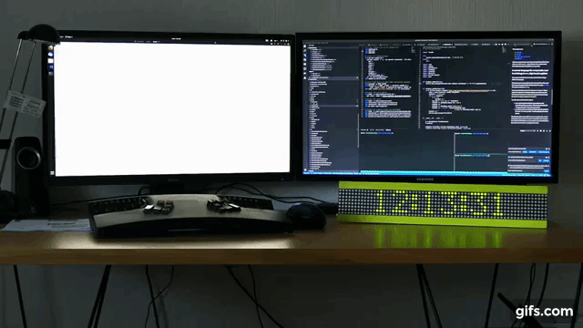

# piledmatrix

[](https://www.youtube.com/watch?v=7lBYZDmsLBE)

The goal of this project is to drive two [Sure 32x08 Green LED 5mm dot matrix](http://store3.sure-electronics.com/de-dp13211) displays using a `Raspberry Pi` v3. 

But the real goal of this project, to be completely honest, is to try out some technologies and best practices when it comes to embedded development on a `Raspberry Pi`. I've always be kind of frustrated not to have a proper "hello world" project that I could use to kick start other embedded project on a `Pi` or any other board available. In this regard, this project may seems like an overkill... but it did allow me to learn and try to apply whatever best practices I could read on:

## A reproducible, cross compiling environment

Building the project and creating artefacts to deliver to your `Pi` should be done in one click. This is [rule number 2 of the Joel Test](https://www.joelonsoftware.com/2000/08/09/the-joel-test-12-steps-to-better-code/). People are getting use to this and most of the projects out there achieve it (for our case, using `CMake` for the `c++` part and `distutils` for the `python` part). 

This project goes a little bit further and provides a `docker` image to make the build. The `docker` image contains:
- All the tools to cross compile `c++` for the `Raspberry Pi` (taken from the ubuntu repositories or from the [raspberry pi fondation github](https://github.com/raspberrypi/tools.git))
- A copy of the rootfs (`/lib` and `/usr` of the [realtimepi-stretch-lite distro](http://unofficialpi.org/Distros/RealtimePi/))
- All the supporting tools (coverage tools, `doxygen`,...)
- The `python` 3 libs and header (they are not part of the base image)

The build is launch like this:
```
cd scripts
./build.sh
```
It will automatically pull the docker image (from dockerhub) and use it to build. In case you want to build the docker image yourself, simply run:
```
cd script
./build-docker.sh
```

## Correct testing in c++ (including coverage)

On most of the `c++` project I've been involved with, testing comes in a second phase. And most of the time, testing is very easily done on the base classes and almost impossible on the complex classes (the one that have tons of dependencies).

In this project, you'll find quiet some pure virtual interfaces (`IGraphics`, `IGraphicsProvider`, ...). Most of them could have been avoided... but I found it easier to have them in order to make testing more easy. 

Testing is done in the `tests/` folder. For this, [`gtest`](https://github.com/google/googletest) and [`gmock`](https://github.com/google/googletest/tree/master/googlemock) are heavily used. All the `c++` interfaces are mocked in `tests/mocks`.

Running the test can be done using the follwing script:
```
cd script
./run.sh IP_ADDRESS_OF_THE_PI
```
The script will only work if you have setup ssh to log in automatically (using `ssh-copy-id pi@IP_ADDRESS_OF_THE_PI`).

Coverage of the code by the tests is done automatically using gcov and lcov. The coverage report can be found in `build/coverage`.


## Documentation

`Doxygen` is enable. The documentation is generated automatically at each build and can be found in `build/html`.


## Dependencies management

This project uses:
- [wiringPi](http://wiringpi.com/)
- [spdlog](https://github.com/gabime/spdlog)
- [google tests and mock](https://github.com/google/googletest)
- [PyBind11](https://github.com/pybind/pybind11)

All these dependencies are built automatically with the help of `ExternalProject_Add` in CMake. No need to install them beforehand or to build them separately.

## A correct language for every tasks: Low level things in c++, high level in python

The project is divided in two levels, each of them using a different language:

**The low level** is responsible for the driving of the LED panel. It interacts directly with the SPI bus of the `Pi` using [wiringPi](http://wiringpi.com/). The code is written in `c++11`.

The low level holds a list of `IGraphicsProviders`. These objects do represent a thing to display such as the current time (`TimeGraphicsProvider`) or a given string message (`SimpleMessageGraphicsProvider`). 

Two threads are driving the system: 
- A low priority thread that is responsible for the scheduling of the providers. This thread will elect the "current provider". It is ran every second.
- A real time high priority thread that takes the graphics from the "current provider" and that displays it on the screen.

**The high level** is responsible for more complex tasks, where a language such as `python` is more convenient. For example, it is at this level that the current weather report is fetch from the internet and made to a displayable string.

